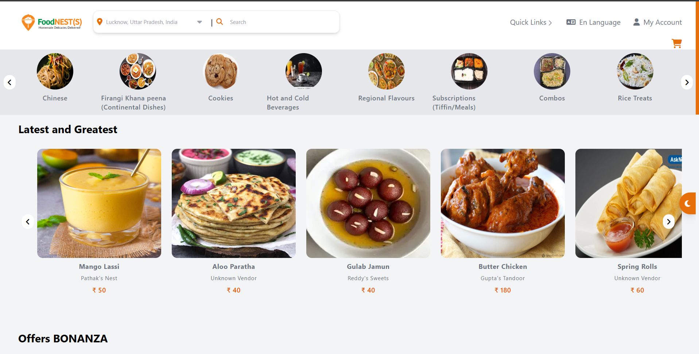
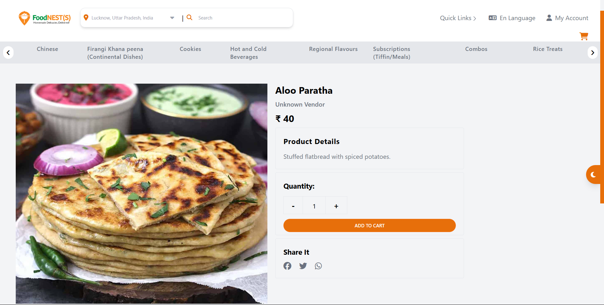
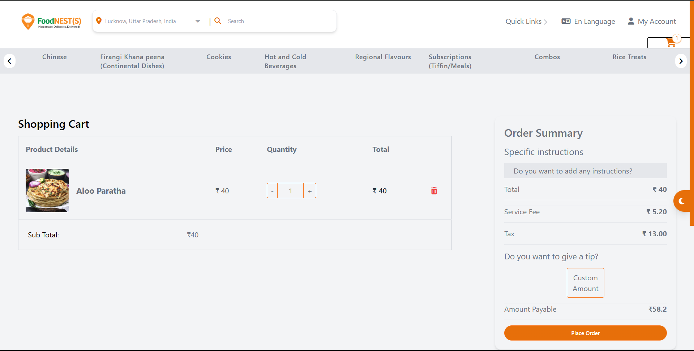

# FoodNests

FoodNests is a modern food ordering web application developed using **Alpine.js**, **HTML**, **Tailwind CSS**, **Firebase** for authentication and storage, and **Stripe** for payment gateway integration. This project aims to provide users with a seamless food ordering experience while exploring the lightweight features of Alpine.js and the robust backend services of Firebase.

---

## Table of Contents

- [Overview](#overview)
- [Features](#features)
- [Tech Stack](#tech-stack)
- [Project Structure](#project-structure)
- [How Alpine.js Works](#how-alpinejs-works)
- [Challenges Faced](#challenges-faced)
- [Comparison: Alpine.js vs React](#comparison-alpinejs-vs-react)
- [Advantages of Alpine.js](#advantages-of-alpinejs)
- [Advantages of Firebase with Alpine.js](#advantages-of-firebase-with-alpinejs)
- [Progressive Web App (PWA) Features](#progressive-web-app-pwa-features)
- [APK Conversion Using PWA Builder](#apk-conversion-using-pwa-builder)
- [Setup and Installation](#setup-and-installation)
- [Screenshots](#screenshots)
- [Conclusion](#conclusion)


---

## Overview

**FoodNests allows users to browse food items, add them to the cart, and securely complete their orders using Stripe. Firebase handles user authentication, profile management, and real-time product updates. The project demonstrates how a lightweight JavaS**cript framework like Alpine.js can work efficiently in a modern web application.

---

## Features

- **User Authentication**: Sign-up, login, and profile management using Firebase.
- **Product Management**: Real-time product fetching and display.
- **Cart Functionality**: Add, remove, and view items in the cart.
- **Secure Payments**: Stripe integration for seamless transactions.
- **Responsive Design**: Built with Tailwind CSS for a mobile-friendly experience.
- **Informational Pages**: FAQs, Privacy Policies, Terms & Conditions.

---

## Tech Stack

- **Frontend**: Alpine.js, HTML, Tailwind CSS
- **Backend Services**: Firebase (Authentication & Storage)
- **Payment Gateway**: Stripe

---

## Project Structure

```
📦src
 ┣ 📂components
 ┃ ┣ 📂common
 ┃ ┃ ┣ 📜footer.html
 ┃ ┃ ┣ 📜header.html
 ┃ ┃ ┗ 📜navbar.html
 ┃ ┗ 📂shared
 ┃ ┃ ┣ 📜productCard.html
 ┃ ┃ ┗ 📜success.html
 ┣ 📂Firebase
 ┃ ┣ 📜firebaseauth.js
 ┃ ┣ 📜firebaseProductFetch.js
 ┃ ┣ 📜firebaseUserDetailFetch.js
 ┃ ┗ 📜OrderPlaced.js
 ┣ 📂js
 ┃ ┗ 📜component_Injection.js
 ┣ 📂Pages
 ┃ ┣ 📂cart
 ┃ ┃ ┗ 📜cart.html
 ┃ ┣ 📂home
 ┃ ┃ ┗ 📜home.html
 ┃ ┣ 📂Informational pages
 ┃ ┃ ┣ 📜careers.html
 ┃ ┃ ┣ 📜FAQs.html
 ┃ ┃ ┣ 📜privacy_policies.html
 ┃ ┃ ┗ 📜Terms_&_Conditions.html
 ┃ ┣ 📂Login
 ┃ ┃ ┣ 📜login.htm
 ┃ ┃ ┣ 📜loginhandlar.js
 ┃ ┃ ┗ 📜register.html
 ┃ ┣ 📂user
 ┃ ┃ ┣ 📜myOrders.html
 ┃ ┃ ┗ 📜profile.html
 ┃ ┗ 📂vendor
 ┃ ┃ ┗ 📜vendor_registration.html
 ┣ 📂routes
 ┃ ┗ 📜routes.js
 ┣ 📂store
 ┃ ┗ 📜store.js
 ┗ 📂Stripe
 ┃ ┗ 📜stripePay.js
📦assets
 ┣ 📂css
 ┃ ┣ 📜input.css
 ┃ ┗ 📜style.css
 ┗ 📂images
 ┃ ┣ 📂demo
 ┃ ┃ ┣ 📜Cart.png
 ┃ ┃ ┗ 📜Home Page.png
 ┃ ┣ 📂page 404
 ┃ ┃ ┗ 📜green-square.svg
 ┃ ┣ 📜App-Store.png
 ┃ ┣ 📜empty_cart.png
 ┃ ┣ 📜google-play.png
 ┃ ┗ 📜image.png
```

---

## How Alpine.js Works

Alpine.js is a lightweight JavaScript framework designed for minimal scripting needs. It allows developers to add interactivity to HTML elements using simple attributes like `x-data`, `x-bind`, and `x-on`.

### Key Concepts:

- **State Management**: Using `x-data` to define reactive state.
- **Event Binding**: Handling user interactions with `x-on`.
- **Directives**: Similar to Vue.js, directives like `x-if` and `x-show` control DOM rendering.

---

## Challenges Faced

### 1. Learning Curve

- As Alpine.js was new to me, understanding its concepts like `x-data` and `x-bind` took time.

### 2. State Management

- Unlike React, Alpine.js doesn’t provide a centralized state management system, making it challenging to manage global states across components.

### 3. Routing

- Alpine.js doesn’t have built-in routing; custom solutions or external libraries were required.

### 4. Debugging

- Debugging complex interactions was harder due to limited community resources compared to larger frameworks like React.

---

## Comparison: Alpine.js vs React

| Feature              | Alpine.js               | React                     |
| -------------------- | ----------------------- | ------------------------- |
| **Size**             | Lightweight (\~21 KB)   | Larger (\~100 KB)         |
| **State Management** | Localized with `x-data` | Centralized with hooks    |
| **Routing**          | No built-in support     | React Router or similar   |
| **Learning Curve**   | Simple, easy to start   | Steeper for beginners     |
| **Use Case**         | Simple, small projects  | Complex, large-scale apps |

---

## Advantages of Alpine.js

- Lightweight and fast.
- Minimal setup; integrates directly with HTML.
- Ideal for projects with simple interactivity needs.

---

## Advantages of Firebase with Alpine.js

- **Authentication**: Firebase Authentication simplifies user login and registration.
- **Real-Time Database**: Fetches and updates data efficiently.
- **Serverless**: No backend setup required, reducing development time.
- **Integration**: Works seamlessly with Alpine.js, providing real-time updates.

---

## Setup and Installation

1. Clone the repository:

   ```bash
   git clone https://github.com/username/foodnests.git
   ```

2. Navigate to the project folder:

   ```bash
   cd foodnests
   ```

3. Install dependencies:

   ```bash
   npm run tail
   ```

4. Run the application:

   run with local server or live server 

---

## Screenshots

## Home page


## Product Card


## Cart 


----
### Progressive Web App (PWA) Features

This project is designed to be a **Progressive Web App (PWA)**, which enhances the user experience by providing app-like features on web platforms. Below are the key PWA features integrated into the project:

1. **Offline Availability**:  
   Users can access core functionalities and view previously loaded data even without an active internet connection, thanks to the service worker caching mechanism.

2. **Add to Home Screen (A2HS)**:  
   The app prompts users to install it on their devices, enabling a native app-like experience directly from the home screen without downloading from an app store.

3. **Fast Loading Times**:  
   Leveraging caching and preloading strategies, the app delivers faster load times, ensuring smooth and seamless performance.

4. **Responsive Design**:  
   The app is fully optimized for devices of all screen sizes, providing a consistent and user-friendly interface across desktops, tablets, and mobile devices.

5. **Secure**:  
   Served over HTTPS, ensuring data integrity and user privacy.
---
---

### APK Conversion Using PWA Builder

To enhance accessibility, this PWA was converted into an **APK** (Android Package) using [PWA Builder](https://www.pwabuilder.com/). PWA Builder provides an easy way to package a PWA into a native-like mobile app for Android.  

#### Steps to Convert PWA to APK:
1. Build the PWA with all necessary features (offline support, A2HS, etc.).
2. Use PWA Builder:
   - Upload the PWA's URL to [PWA Builder](https://www.pwabuilder.com/).
   - Follow the wizard to configure the app package.
3. Download the generated APK file.
4. Test the APK on Android devices to ensure smooth functionality.  

By providing both a web-based experience and an APK for Android users, this project ensures maximum reach and usability.

---


## Conclusion

FoodNests demonstrates how Alpine.js, Firebase, and Stripe can come together to build a lightweight yet feature-rich food ordering application. The project highlights both the challenges and advantages of using Alpine.js for modern web development.

